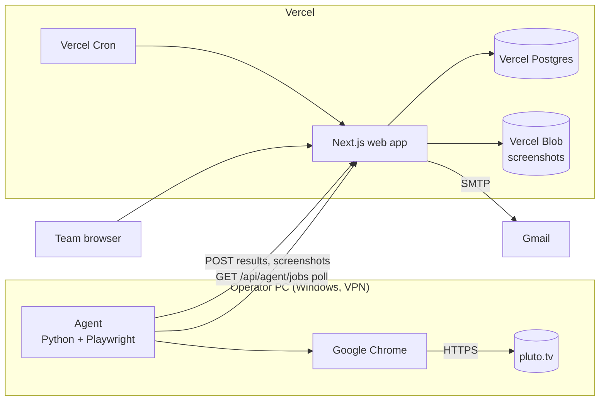
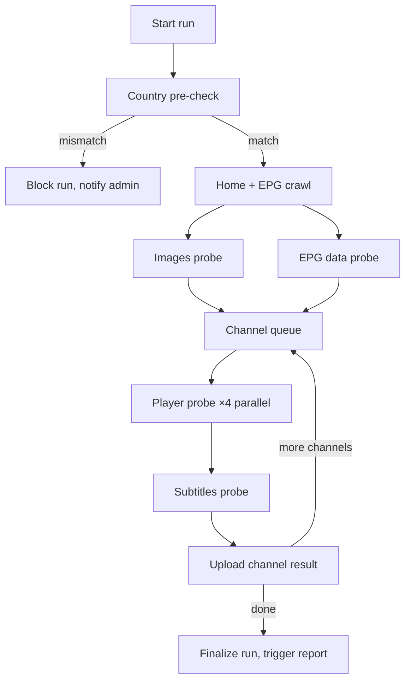
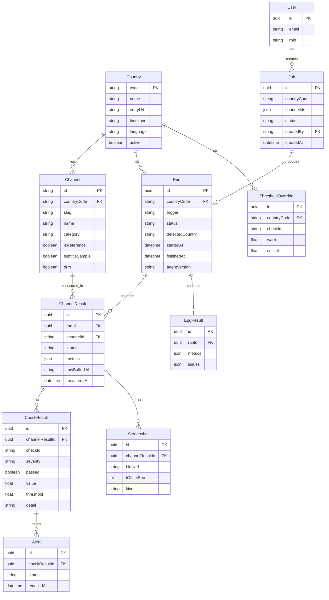

# 02 — Technical Architecture

**Version:** 0.1 (draft) · **Last updated:** 2026-10-09

---

## 1. Overview

Pippo is split into two components that communicate over HTTPS:

- **Agent** — a Python program running on the operator's Windows PC. It drives a real Google Chrome through Playwright, measures the pluto.tv experience, and uploads results and screenshots to the web app's API. It is the only component that uses the operator's VPN.
- **Web app** — a Next.js application deployed on Vercel. It stores results, serves the team dashboard, queues on-demand jobs for the agent, and sends emails.



## 2. Agent

### 2.1 Responsibilities
- Country pre-check (IP geolocation + country resolved by pluto.tv).
- Execute runs: full country run (scheduled) or job-based run (on demand).
- Drive Chrome, record events, capture frames/audio, intercept network calls.
- Compute metrics locally and upload per-channel results.
- Poll the web app for pending jobs.

### 2.2 Stack
| Concern | Choice | Notes |
|---------|--------|-------|
| Language | Python 3.12 | |
| Browser automation | Playwright, `channel="chrome"` | Uses the installed Google Chrome (Widevine available); not Playwright's bundled Chromium |
| Scheduling | APScheduler inside the agent process | Daily run at a configurable hour; jobs polled every 10 s |
| Service | NSSM (Non-Sucking Service Manager) | Agent starts with Windows, restarts on crash |
| Image analysis | Pillow + `imagehash` (pHash) | Placeholder detection, aspect-ratio checks |
| Frame analysis | In-page JavaScript via `page.evaluate` | `<video>` → `<canvas>` sampling: mean luminance (black), inter-frame difference (freeze) |
| Audio analysis | In-page Web Audio `AnalyserNode` | RMS level sampled at 2 Hz; no OS audio drivers needed |
| Subtitle sync | `faster-whisper` (model `small`, CPU) | Only on the configured sample of channels; audio captured via `MediaRecorder` in page |
| HTTP client | `httpx` | Uploads with retry and exponential backoff |
| Config | `agent/config.yaml` + `.env` | Selectors and API routes live in `agent/pluto_profile.yaml` so they can change without code changes |

### 2.3 Run pipeline



Each channel is measured in an isolated browser context (fresh cookies, same persistent profile for consent) for a fixed observation window (default 60 s). Four contexts run in parallel. An exception in one channel marks that channel `error` and the run continues.

### 2.4 Recorder
During a channel session the agent records to a local buffer:
- Player events (`loadstart`, `playing`, `waiting`, `stalled`, `timeupdate`, `error`, `ratechange`) with timestamps.
- Frame samples every 1 s: mean luminance and difference from previous sample.
- Audio RMS every 500 ms.
- Network: HLS manifest and segment requests (status, duration), the EPG API responses, image requests (status, size, content-type).
- Screenshots at t = 10 s, 30 s, 60 s and on first failure.
- `textTracks` state and visible cue text every 2 s.

Probes compute metrics from this buffer after the window ends. The raw buffer (JSON) is uploaded alongside the result for later inspection.

### 2.5 Discovery mode
`pippo discover --country IT` opens pluto.tv, logs all network calls, dumps the DOM structure of home/EPG/player, and writes screenshots to `agent/discovery/`. Used to populate or repair `pluto_profile.yaml` when the front-end changes.

### 2.6 Local state
The agent keeps a small SQLite file (`agent/state.db`) for: last successful upload cursor, pending uploads (offline queue), and the local run log. If the web app is unreachable, results are queued and flushed later.

## 3. Web app

### 3.1 Stack
| Concern | Choice |
|---------|--------|
| Framework | Next.js 15 (App Router), TypeScript |
| UI | Tailwind CSS + shadcn/ui |
| Charts | Recharts |
| Database | Vercel Postgres (Neon) via Prisma |
| File storage | Vercel Blob (screenshots, raw buffers) |
| Auth | Auth.js (NextAuth) with Email provider — magic link; roles `admin`, `member` |
| Email | Nodemailer → Gmail SMTP (App Password); React Email templates |
| Scheduled tasks | Vercel Cron: daily report fallback, retention cleanup, stale-job expiry |
| Hosting | Vercel, auto-deploy from GitHub `main` |

### 3.2 API (agent-facing)
All agent endpoints require header `Authorization: Bearer <AGENT_API_KEY>`.

| Method | Route | Purpose |
|--------|-------|---------|
| GET | `/api/agent/jobs` | Return pending jobs for this agent (long-poll up to 25 s) |
| POST | `/api/agent/jobs/:id/ack` | Mark a job as started |
| POST | `/api/agent/runs` | Create a run (country, trigger, agent version, detected country) |
| POST | `/api/agent/runs/:id/channels` | Upload one channel result (metrics, checks, status) |
| POST | `/api/agent/runs/:id/epg` | Upload EPG probe results |
| POST | `/api/agent/upload` | Get a signed Blob upload URL for a screenshot or raw buffer |
| POST | `/api/agent/runs/:id/finish` | Finalize the run; triggers report email and alerts |
| POST | `/api/agent/heartbeat` | Agent status (online, current country, VPN check result) |

### 3.3 Internal flows
- **On-demand run**: user clicks *Run test* → `Job` row created (`pending`) → agent picks it up on next poll → acks → runs → uploads → finishes. UI shows job state live via polling.
- **Alerts**: on each channel upload, the server evaluates checks against thresholds; `critical` findings create an `Alert` and, if no alert for the same (channel, check) exists in the last 24 h, send an email.
- **Daily report**: triggered by `/finish` for scheduled runs; a Vercel Cron also sends a "no run received today" notice if nothing arrived by a configured hour.

## 4. Data model



Status values: `Run.status` ∈ {running, completed, blocked, failed}; `ChannelResult.status` ∈ {ok, warning, critical, error}; `Job.status` ∈ {pending, running, done, expired}.

## 5. Security

- Agent ↔ web app: single long random `AGENT_API_KEY` stored in the agent `.env` and in Vercel environment variables; rotate from the admin settings page.
- Dashboard: magic-link login only for emails invited by the admin; sessions via Auth.js; `admin` role required for settings and user management.
- Secrets never committed; `.env.example` documents required variables.
- Blob URLs for screenshots are private and served through a signed, short-lived URL endpoint.
- Rate limiting on agent endpoints (per key) and on login requests.

## 6. Country handling

- `countries.yaml` (agent) and the `Country` table (web) are seeded from the same list; the web app is the source of truth, the agent syncs it at startup.
- Pre-check: `GET https://ipinfo.io/json` (or configured provider) for IP country, plus the country field returned by pluto.tv's bootstrap call (route configured in `pluto_profile.yaml`). Both must equal the selected country.
- Each country has its own Chrome persistent profile directory so consent cookies and language do not leak between countries.
- The selected country is set by the admin in the web app (*Settings → Active country*); the agent reads it via the heartbeat response. Changing the VPN without updating the selection results in a blocked run.

## 7. Known limitations and mitigations

| Limitation | Mitigation |
|------------|------------|
| DRM content: canvas frames are black by design | Detect `encrypted` event; skip black/freeze checks, use OS-level screenshot heuristics, flag channel `drm=true` |
| Serverless functions on Vercel have execution limits | Agent does all heavy work; API handlers only persist and evaluate; report email generation kept under 10 s |
| One country at a time (manual VPN) | Later phase: per-country proxies via Playwright `proxy` per context |
| Front-end changes break selectors | Selectors in config + discovery mode + "selector health" check that fails fast with a clear message |
| Operator PC offline | Web app shows agent last heartbeat; Cron sends "no run today" email |

## 8. Repository and environments

```
/
├── agent/
│   ├── pippo/                 package: runner, probes, recorder, API client
│   ├── pluto_profile.yaml     selectors and API routes for pluto.tv
│   ├── countries.yaml         seed list
│   ├── config.yaml            threshold defaults, parallelism, windows
│   ├── .env.example
│   └── README.md
├── web/
│   ├── app/                   Next.js App Router
│   ├── prisma/schema.prisma
│   ├── emails/                React Email templates
│   ├── .env.example
│   └── README.md
└── docs/
```

Environments: `production` (Vercel, branch `main`) and `preview` (Vercel preview deployments per pull request, pointing to a separate Neon branch).
